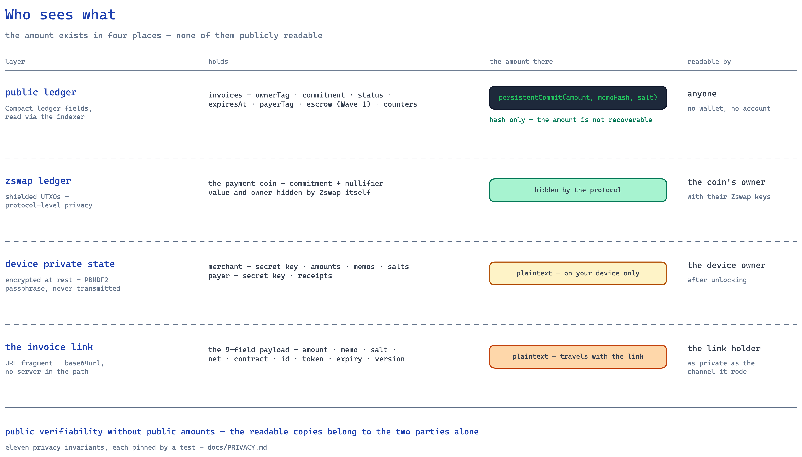
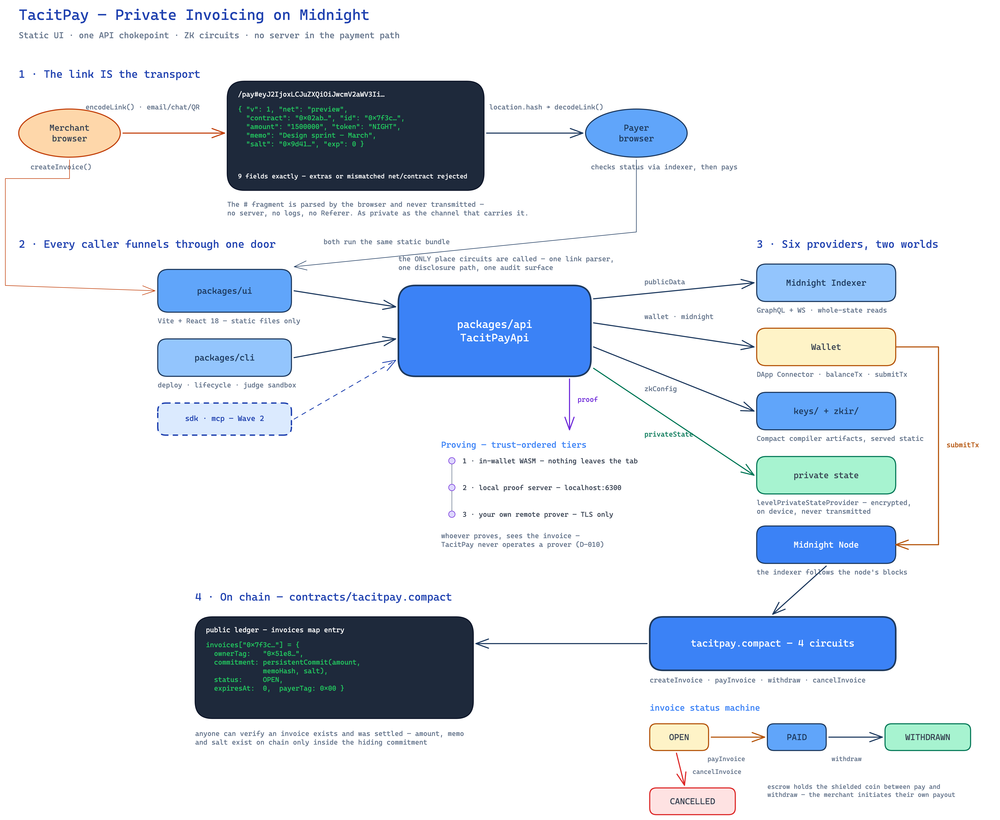

<p align="center">
  <picture>
    <source media="(prefers-color-scheme: dark)" srcset=".github/assets/logo-dark.svg">
    
  </picture>
</p>

**Private invoicing & settlement on Midnight. Private by default, provable on demand.**


## Wave 1 status

- **Where we are.** Wave 1 of the Midnight Buildathon 2026 (AKINDO WaveHack, three waves, Aug 27 to Nov 27). The Wave 1 loop is built, tested and live: a merchant issues an invoice, a client pays it, anyone can verify it settled, the merchant withdraws.
- **Live on Midnight Preview since Aug 26, 2026.** The app: [app.tacitpay.xyz](https://app.tacitpay.xyz). Docs and whitepaper: [docs.tacitpay.xyz](https://docs.tacitpay.xyz). Landing: [tacitpay.xyz](https://tacitpay.xyz).
- **The contract on chain:** [`0847de8a…326d24`](https://preview.midnightexplorer.com/contracts/0847de8a3ad855db18622017f2333b673afd9a1a72e0127b3e766d0c23326d24), recorded in [`deployments/preview.json`](./deployments/preview.json). This is version 2: both settlement lanes, denominated in bridged USDM (decision D-022). Version 1, [`1f3783…bc547`](https://preview.midnightexplorer.com/contracts/1f37835dd1f3ba29cfa912385ff6f0059f66aad9cad6b5dc8686b8a3e21bc547), hosted the first real in-browser invoice, created and proven from a Lace wallet on day one.
- **Proven end to end.** On Aug 27 the full loop (create, pay, verify, withdraw) ran between two Lace wallets on the live contract, invoice `084318a7…f0342`, every step confirmed on chain.
- **Tested.** 98 unit tests run offline in seconds with no wallet and no Docker; 67 integration tests run against a live devnet. `yarn test`.
- **Where to read more.** [`PRD.md`](./PRD.md) is the single source of truth. [`docs/WAVE-CHANGELOG.md`](./docs/WAVE-CHANGELOG.md) is what shipped, dated. [`docs/AUDIT-RESPONSE.md`](./docs/AUDIT-RESPONSE.md) answers an external product audit. [`docs/VISION.md`](./docs/VISION.md) is the three-wave arc.
- **Deck, script, video.** [Twelve-slide deck](./docs/deck/index.html), [the six-slide recording deck](./docs/deck/demo.html), [the spoken script](./docs/DEMO-TALK-TRACK.md). Video: [link].

TacitPay is a **protocol for private invoicing and settlement** on Midnight.

One party issues an invoice. Another settles it on-chain. What reaches the public ledger is a **commitment** (a hash of the amount, the memo and a random salt) plus a status flag and an expiry. The amount, the memo and both parties' identities stay in private state on their own devices and are never published.

The point is holding two things at once that normally conflict: **anyone can verify an invoice was settled**, while **nobody can see what it was for**. A transparent chain gives you the first and destroys the second. A fully anonymous one gives you the second and makes the first impossible.

### Who this is for

It is not a merchant app. The protocol knows exactly two roles, whoever issued an invoice and whoever paid it, and it does not care what either of them is. (The contract and the code call the issuing role _merchant_, because that is what the witness and the owner tag are named. Read it as "issuer" everywhere.)

- **Anyone who bills anyone.** Freelancers, contractors, agencies, suppliers, B2B counterparties. The invoice is the unit; the business model behind it is none of the protocol's business.
- **Anyone who pays.** Payers get their own private receipts and the same unlinkability the issuer does. This is not a one-sided privacy guarantee.
- **Anyone who needs to verify.** `/verify/<id>` needs no wallet, no account and no permission. A third party (a counterparty, an accountant, a court) can confirm settlement without learning anything else.
- **Software, not just people.** `packages/api` is the integration surface, and it is the only place a circuit call happens. Wave 2 adds an npm SDK and an MCP server so agents can issue and settle invoices the same way a person does.
- **Auditors and lenders**, in Wave 3: prove facts about revenue, such as "I received ≥ X this quarter", without revealing a single underlying invoice.

## Why privacy is load-bearing

On transparent chains, every stablecoin payment permanently publishes who paid whom, how much, and, via address clustering, the payee's entire income history and counterparty list. That is true whether the payee is a company, a two-person studio, a freelancer or an autonomous agent, and it is why most of them settle in stablecoins reluctantly or not at all. Publishing your rate card to every competitor and your customer list to every recruiter is not a side effect anyone signed up for.

The opposite extreme does not work either. Fully anonymous payments cannot be shown to an accountant, an auditor, a lender or a counterparty in a dispute, so they are unusable for anyone who has to account for their income, which is nearly everyone.

TacitPay uses Midnight's dual-ledger model to hold both ends:

| Data                    | Public ledger                              | Payer                   | Merchant               | Verifier with a proof      |
| ----------------------- | ------------------------------------------ | ----------------------- | ---------------------- | -------------------------- |
| Invoice amount          | **Hidden** (commitment only)               | Known (from link)       | Known                  | Only the fact being proved |
| Memo / line items       | Hidden (hash inside commitment)            | Known                   | Known                  | Hidden                     |
| Merchant identity       | Hidden (per-invoice tag, unlinkable)       | Knows who sent the link | n/a                    | Only if merchant proves it |
| Payer identity          | Hidden (shielded payment, per-invoice tag) | n/a                     | Not learned from chain | Only if payer proves it    |
| Invoice exists + status | **Public by design**                       | Public                  | Public                 | Public                     |

The only values ever `disclose()`d are on the allowed-public list in PRD §4.3. The eleven privacy invariants (INV-1…INV-11) each get a test; see [`docs/PRIVACY.md`](./docs/PRIVACY.md).

<a href="./docs/tacitpay-privacy-map-dark.png">
  <picture>
    <source media="(prefers-color-scheme: dark)" srcset="./docs/tacitpay-privacy-map-dark.png">
    
  </picture>
</a>

## Dual-ledger design

| Layer                                    | Holds                                                                                                  |
| ---------------------------------------- | ------------------------------------------------------------------------------------------------------ |
| Public ledger (Compact `ledger`)         | `invoices` map (ownerTag, commitment, status, expiry, payerTag), escrow, token colour, global counters |
| Zswap shielded ledger                    | The payment coin itself, amount and owner hidden by the protocol                                       |
| Private state (client device, encrypted) | Merchant: secret key, invoice bodies, salts, memos · Payer: secret key, receipts                       |
| Off-chain transport (URL fragment)       | The invoice link payload, never sent to any server                                                     |

The whole system on one canvas: the link as the transport, every caller
funnelling through one API, the six providers, and what actually reaches the
chain:

<a href="./docs/tacitpay-architecture-dark.png">
  <picture>
    <source media="(prefers-color-scheme: dark)" srcset="./docs/tacitpay-architecture-dark.png">
    
  </picture>
</a>

<sub>Follows your color scheme · editable sources: [`dark`](./docs/tacitpay-architecture-dark.excalidraw) · [`light`](./docs/tacitpay-architecture.excalidraw); open them at [excalidraw.com](https://excalidraw.com).</sub>

More in [`docs/ARCHITECTURE.md`](./docs/ARCHITECTURE.md), which expands each
circuit into its own diagram derived from the code.

## Contract

`contracts/tacitpay.compact` implements six circuits, the four core ones (`createInvoice`, `payInvoice`, `withdraw`, `cancelInvoice`) plus the unshielded-lane pair (`payInvoiceUnshielded`, `withdrawUnshielded`, per D-022), with Variant A escrow, compiled by compact compiler 0.31.1 against `@midnight-ntwrk/compact-runtime` 0.16.0.

| Circuit                | Asserts                                                                           | Ever made public                                         |
| ---------------------- | --------------------------------------------------------------------------------- | -------------------------------------------------------- |
| `createInvoice`        | id unused, amount > 0                                                             | invoice id, owner tag, expiry, commitment                |
| `payInvoice`           | invoice OPEN, not expired, commitment matches the preimage, coin colour and value | payer tag, status, escrowed coin (Variant A)             |
| `payInvoiceUnshielded` | invoice OPEN, not expired, commitment matches the preimage                        | payer tag, status, owed amount (public by lane's nature) |
| `withdraw`             | invoice PAID on the shielded lane, caller's secret derives the stored owner tag   | status                                                   |
| `withdrawUnshielded`   | invoice PAID on the unshielded lane, caller's secret derives the stored owner tag | status, payout to the merchant-chosen address            |
| `cancelInvoice`        | invoice OPEN, caller's secret derives the stored owner tag                        | status                                                   |

Each lane guards the other's exit (`withdraw` refuses an invoice paid unshielded and vice versa), so funds can never be claimed through the wrong door.

The amount, memo and both parties' secrets are never disclosed; only a `persistentCommit` of the invoice body reaches the ledger. Ownership is proven from the witness secret, never from `ownPublicKey()` (which is prover-supplied and so is not an authorization check).

## Try it

Four ways in, cheapest first. Pick one before installing anything.

| Path                     | Needs                             | Docker?                                                                                        | Proves                                                         |
| ------------------------ | --------------------------------- | ---------------------------------------------------------------------------------------------- | -------------------------------------------------------------- |
| **a. Unit tests**        | Node, yarn                        | No, and no wallet                                                                              | The contract is correct and leaks nothing: 98 tests in seconds |
| **b. Preview with 1AM**  | The 1AM extension, testnet funds  | No: 1AM proves in-browser                                                                      | The whole product, live, with only a browser extension         |
| **c. Preview with Lace** | The Lace extension, testnet funds | Lace proves through the proof server it is configured with: local `:6300` or Midnight's hosted | The same, on the wallet most people already have               |
| **d. Local devnet**      | Docker, `../midnight-local-dev`   | Yes: node, indexer, proof server                                                               | Everything, against a chain you control, with a seeded sandbox |

```bash
corepack enable && yarn install
yarn compile                           # needs the compact CLI (PRD §0.2)
yarn test                              # 98 unit tests, offline, no wallet
yarn workspace @tacitpay/ui run dev    # http://localhost:5173
```

Local devnet, for the integration suite and the judge sandbox:

```bash
git clone https://github.com/midnightntwrk/midnight-local-dev.git ../midnight-local-dev
yarn env:up          # node :9944, indexer :8088, proof server :6300
yarn demo:seed       # two funded wallets, a contract, three invoices (OPEN, PAID, WITHDRAWN), a ready /pay# link
TACITPAY_INT=1 yarn workspace @tacitpay/api run test   # live lifecycle, about 2 minutes
yarn env:down
```

**The live app** is [app.tacitpay.xyz](https://app.tacitpay.xyz), baked to the Preview contract in `deployments/preview.json`. Out of the box every screen runs on an in-memory sandbox; to go live, open Settings, connect a wallet, and unlock private state with a passphrase. That passphrase encrypts your invoice bodies in this browser only: never sent, never recoverable. Until the Settings card says **Live**, every write is sandbox theater. The app reports success only after it has confirmed the transaction in the contract's public state; a wallet's "submitted" is not treated as truth.

**Proving.** Whoever generates a proof sees the invoice, so TacitPay never runs a prover. It feature-detects, in order: your wallet (1AM, in-browser), a local proof server on `localhost:6300`, or a server you host over TLS. The header shows which one is active.

**Verified on Preview.** Lace 4.0.1 created the first real invoice on Aug 26 2026 (block 587,108). On Aug 27 the full loop (create, pay, verify, withdraw) ran between two Lace wallets on contract `0847de8a…326d24`, invoice `084318a7…f0342`, 2 tUSDM, every step confirmed on-chain. Preview settles through the unshielded lane in bridged tUSDM: the transfer is public, the invoice contents never are, and the shielded lane runs on the local devnet (see Known limitations).

**Tests.**

| Suite                        | Result                                                                                                |
| ---------------------------- | ----------------------------------------------------------------------------------------------------- |
| `contracts` (unit)           | 28 passed, 10 Wave 2/3 todos: U-01 to U-17, U-17b, the unshielded lane U-29 to U-36                   |
| `packages/api` (unit)        | 70 passed: link codec, amounts, errors, private state, the DApp Connector bridge, the unshielded lane |
| `packages/api` (integration) | 67 passed against a live devnet in about 120 s (`TACITPAY_INT=1`)                                     |

Everything runs offline in the pure-JS runtime, coin circuits included. U-17 serialises the public ledger after a full lifecycle and asserts the amount (in four encodings), the memo hash, the salt and both secrets are absent; U-17b pins the Variant A exposure window so it stays a tested limitation. The integration suite's load-bearing check is that the merchant's balance increases after withdrawal: a status flip proves state changed, the balance proves value moved.

Where things are: `contracts/` (the Compact contract, witnesses, unit tests) · `packages/api` (the one place circuits are called) · `packages/cli` · `packages/ui` · `packages/docs` ([docs.tacitpay.xyz](https://docs.tacitpay.xyz)) · `deployments/` · `docs/` (PRD, PRIVACY, ARCHITECTURE, DECISIONS, changelog).

## Roadmap

Three waves, one arc: **Wave 1 makes invoices private, Wave 2 makes them complete, Wave 3 makes them provable.** The arc is in [`docs/VISION.md`](./docs/VISION.md), progress in [`docs/WAVE-CHANGELOG.md`](./docs/WAVE-CHANGELOG.md), the ordering rationale in [`docs/AUDIT-RESPONSE.md`](./docs/AUDIT-RESPONSE.md).

### Wave 1 (Aug 27 to Sep 16): the loop works. Done.

- **Contract:** six circuits (`createInvoice`, `payInvoice`, `withdraw`, `cancelInvoice`, plus the unshielded pay and withdraw pair), Variant A escrow, deployed on Preview at `0847de8a…326d24`.
- **Tests:** 28 contract and 70 library unit tests offline; 67 integration tests on a live devnet.
- **`packages/api`:** the single audited path to the chain; strict link codec; private state; ledger reads; status observables; browser and Node providers with three proving tiers.
- **`packages/cli`:** deploy, the lifecycle, DUST status, the judge sandbox.
- **The web app, live on Preview:** ten routes; wallet detection; the truth gate; a pay-page preflight for balance and DUST; the settlement pair in the create dialog; bearer-link disclosure at the copy moment; a passphrase form that knows first-time from return. Full lifecycle proven between two Lace wallets on Aug 27.
- **Docs:** PRD, PRIVACY (eleven invariants mapped to tests), ARCHITECTURE, DECISIONS (24 records), an external audit answered point by point, the vision.
- **Platform:** the shielding gap diagnosed, raised with the community, and confirmed by Midnight core engineering as a fixed-but-unreleased Wallet SDK bug; the unshielded lane shipped in response.
- **Decks and script:** [`docs/deck/index.html`](./docs/deck/index.html) (twelve slides), [`docs/deck/demo.html`](./docs/deck/demo.html) (the six used in the video), [`docs/DEMO-TALK-TRACK.md`](./docs/DEMO-TALK-TRACK.md).

### Wave 2 (Sep 27 to Oct 17): the product completes

In order:

1. **Shielded settlement on public networks**, by two routes: native Wallet SDK shielding for programmatic wallets (CLI, SDK, agents) once the upstream fix ships, and a contract-minted shielded wrapper for browser wallets. The greyed Private card turns on: per-invoice public or private settlement.
2. **Funds safety:** Variant B escrow, milestone escrow with payer-approved release, claim-based refunds, a timeout escape hatch.
3. **Zero-setup payers:** sponsored DUST, a guided wallet path.
4. **Secure links v2** (in-circuit ids, link expiry and revocation, optional recipient binding) and **invoice document v1** (number, dates, customer, line items, notes, inside the same commitment).
5. **Encrypted backup and restore** of private records across devices.
6. **Notifications relay** (public state only) and privacy-preserving **webhooks**.
7. **Node SDK** on npm and an **MCP server**, so software agents invoice the way people do.

Video: an agent creates an invoice from Claude Code; a client pays it privately on Preview; a milestone is approved and withdrawn; a refund is claimed; a retainer's second period is paid from one standing link.

### Wave 3 (Oct 27 to Nov 16): prove it to the auditor

1. **Zero-knowledge revenue proofs:** "I received at least X between these dates", verified on a public page with no invoice exposed.
2. **Receivables proofs:** "at least X outstanding, none expired", the underwriting primitive for invoice financing.
3. **The rest of the invoice document:** taxes and discounts, merchant profile and terms templates, PDF export, QR share, duplicate and template, attachments bound by hash.
4. **Reconciliation:** search, tags, monthly statements, CSV and JSON exports, fiat value at pay time.
5. **A mobile app as an installable PWA:** verification, QR scanning and your own books on any phone, with Android payments through the Kuira wallet.
6. **Trust before value:** an independent contract audit, a protocol version registry with a migration policy, the business-model decision.
7. **USDM on mainnet** (stretch), validated on Preprod first.

Video: a lender verifies a revenue claim with no invoice data exposed; a phone scans and verifies an invoice; a real USDM invoice is paid and withdrawn.

## Known limitations

Stated openly per PRD §4.5:

- **Payment timing is correlatable.** An observer learns "some invoice was paid at time T", never the amount or the parties.
- **Anonymity sets are small on a young network.** Inherent to any new chain.
- **Whoever issued the invoice learns who paid it.** Off-chain, because they sent them the link. Normal commerce, not a chain leak.
- **The Preview pay leg settles unshielded, for now.** No user-side operation on today's public testnets converts unshielded funds to shielded: the faucet dispenses unshielded only, Lace has no shield control, and the Wallet SDK's shielding swap (`initSwap`) is broken on stable releases through 1.2.0. Midnight core engineering confirmed on Aug 29, 2026 that this is a fixed-but-unreleased SDK bug (midnight-wallet PR #615), not a protocol limit. So Preview invoices settle as public transfers denominated in bridged tUSDM while the invoice contents stay off-ledger either way. The fully shielded flow runs on the local devnet today, and Wave 2 brings it to public networks by two routes (see `docs/AUDIT-RESPONSE.md` and D-020 in `docs/DECISIONS.md`).
- **The invoice link is a bearer credential.** Anyone holding it can read the amount and memo and pay the invoice. The create dialog says so at the copy moment; revocation and recipient binding are Wave 2 (PRD §15.8, `docs/PRIVACY.md` §6.6).
- **Wallet-reported transaction IDs are ledger _identifiers_, not hashes.** Explorers index the 64-hex transaction _hash_, so pasting the ID a wallet shows into an explorer search finds nothing. The indexer maps between the two; the success dialog deep-linking by hash is a pending fix.
- **A forgotten private-state passphrase loses invoice bodies.** The chain still proves the invoice existed and was settled; the amount, memo and salt are gone. Export/import is the Wave 2 mitigation (D-014).
- **Variant A escrow leaks while it holds the coin, and more than value.** The escrowed coin's nonce is public, so after a withdrawal an observer who guesses the merchant's Zswap key can confirm it against the withdrawal's coin commitment, linking that merchant's withdrawals in transaction history. Withdrawing does not undo it. Wave 2's Variant B escrow removes the exposure; test U-17b pins the current behaviour meanwhile.

---

Live: [tacitpay.xyz](https://tacitpay.xyz) · [app.tacitpay.xyz](https://app.tacitpay.xyz) · [docs.tacitpay.xyz](https://docs.tacitpay.xyz)
Built on [Midnight](https://midnight.network) · [Compact docs](https://docs.midnight.network) · [Midnight Academy](https://academy.midnight.network/) · Midnight Expert used for verified Compact generation.
Licensed under [Apache-2.0](./LICENSE).
