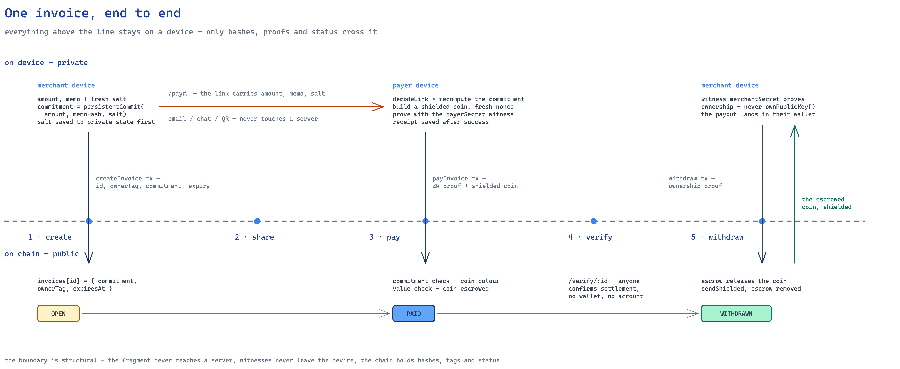
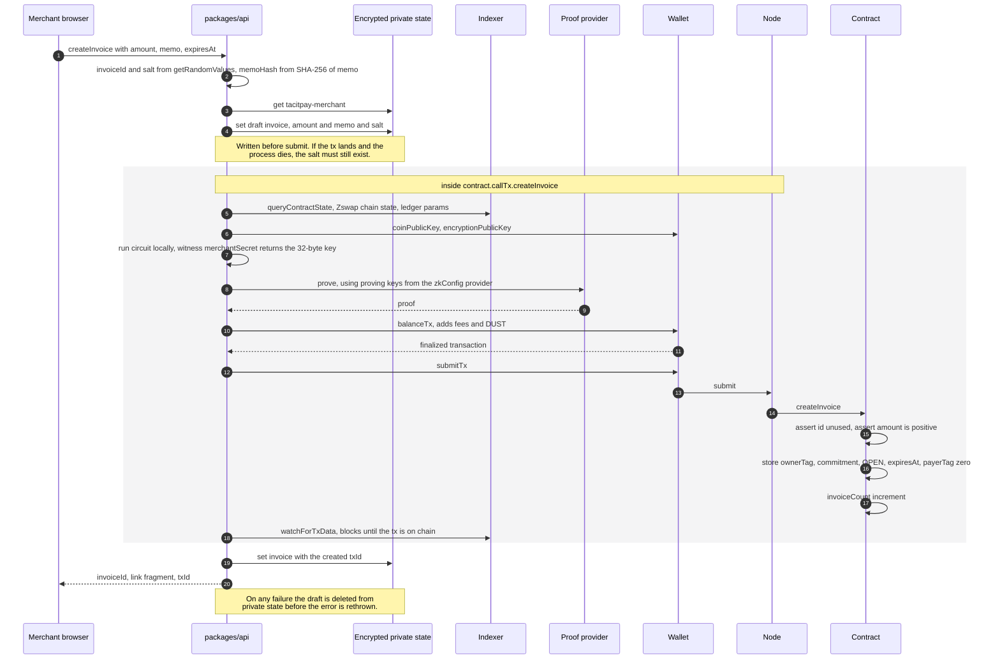
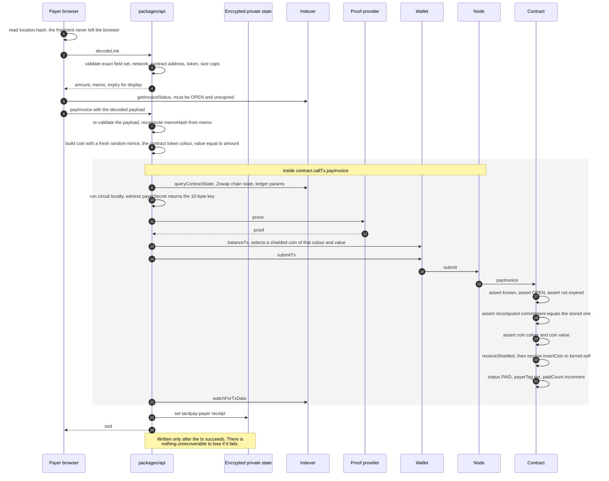
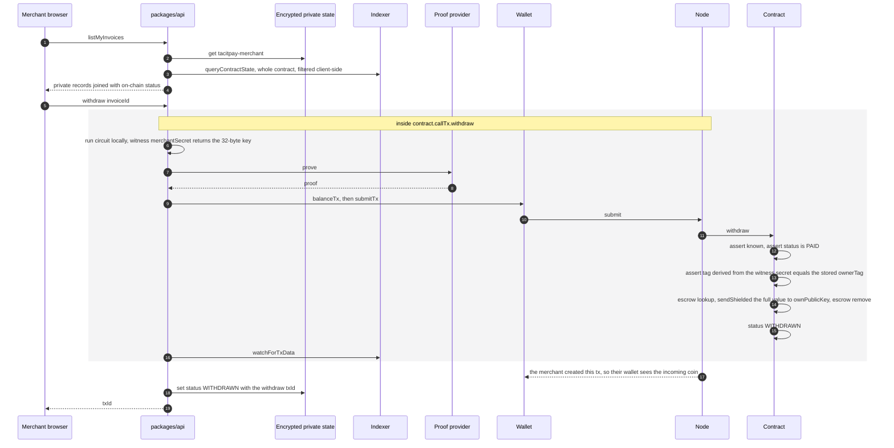
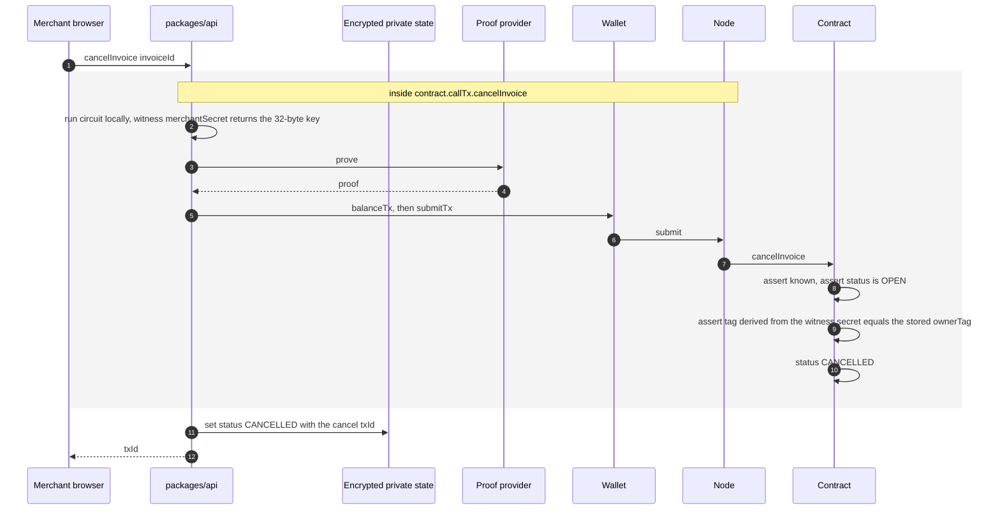

# Architecture

**As of 2026-08-24.** Expanded from PRD §5. The diagrams below were derived by
reading `contracts/tacitpay.compact` and `packages/api/src/api.ts`, not from the
spec — where the spec and the code disagreed, the code won.

Related: [`PRIVACY.md`](./PRIVACY.md) explains what each layer may hold,
[`DECISIONS.md`](./DECISIONS.md) records why the tooling is what it is, and
[`CURRENT-STATE.md`](./CURRENT-STATE.md) is the honest status of each piece.

---

## 1. System overview

Four components. Three of them exist to keep the fourth honest.

```
Browser (Vite + React 18 + TS)  packages/ui
  /  ·  /app  ·  /invoices  ·  /invoices/:id  ·  /pay  ·  /payments
  /verification  ·  /verify/:id  ·  /profile  ·  /settings
        │
  packages/api  (TacitPayApi — the ONLY place circuit calls happen)
  Midnight.js providers: privateState (encrypted, on device) · publicData
  (indexer GraphQL) · zkConfig · proof (three tiers) · wallet · midnight
        │                              │
  Midnight Indexer               Proof provider (in-wallet WASM,
        │                        localhost:6300, or the user's own host)
  Midnight Node  ◄── transactions
        │
  contracts/tacitpay.compact  (public ledger: invoices Map, escrow, counters)

  packages/cli — deploy + full lifecycle + judge sandbox, for demos and tests
  packages/sdk, packages/mcp — Wave 2
```

### Why the boundary is where it is

**`packages/api` is the only place a circuit is ever called.** The UI, the CLI
and — in Wave 2 — the MCP server and the Node SDK all go through it. That is
deliberate: there is exactly one code path that decides what gets disclosed,
one link parser that handles attacker-controlled input, one error mapping, one
place to audit. A second entry point would be a second chance to leak something.

**The contract is a separate package from the API** because the generated
contract module (`contracts/managed/tacitpay`) is a build artifact of the
Compact compiler, not TypeScript anyone writes. `packages/api` imports it the
way any consumer would, which is what lets the same code run in the unit tests,
the CLI, and the browser.

**The CLI exists so the whole lifecycle is verifiable without a browser.** A
judge can deploy, create, pay, withdraw and cancel with no wallet extension and
no UI. It is also how the integration test drives a real devnet.

### Why Vite and not Next.js

The invoice payload lives in the URL fragment. Browsers never send the part
after `#` to a server — that is the entire mechanism by which the amount and
memo reach the payer without a backend seeing them.

A server runtime breaks that in two ways. First, it reintroduces the exact
surface the privacy claim denies: with SSR, some server renders `/pay`, and now
there is a machine whose logs, error reporter and middleware sit in the path of
invoice traffic — even if the fragment itself still never arrives, the claim
stops being structural and becomes a promise about configuration. Second, it
makes the claim unverifiable to a judge. A static bundle can be read, hashed
and served from anywhere; "our server does not log this" cannot be checked from
outside.

So `packages/ui` builds to static files. The deployment requirement this
creates is an SPA rewrite, so `/verify/<id>` survives a page refresh.

### Where it stands today

The Node path is fully wired and verified against a live devnet.

The browser path is built and reachable. `packages/ui/src/lib/api/real.ts`
adapts `@tacitpay/api` to the PRD §8.1 boundary, and
`packages/ui/src/lib/api/live.tsx` installs it through `TacitPayProvider` once a
contract address, a wallet and a prover are all present and the user unlocks
their private state from `/settings`. Precedence is explicit injection, then
live, then the in-memory mock (`mock.ts`, typed against the same interface),
which is what runs until the app is pointed at a contract.

What has **not** happened is a run against a real wallet extension: that needs a
funded wallet and a deployed contract. The wire format is not part of that gap —
the connector types specify only `tx: string`, so the hex encoding and the
transaction markers were checked against midnight-js's own
`DAppConnectorWalletAdapter`, which implements the receiving side of the same
interface (D-013).

Check the repository rather than this paragraph — it is the part of this
document most likely to be stale.

---

## 2. Circuit sequences

The whole lifecycle at a glance — the dashed line is the device/chain boundary,
and only hashes, proofs and status ever cross it:

<a href="./diagrams/tacitpay-invoice-lifecycle-dark.png">
  <picture>
    <source media="(prefers-color-scheme: dark)" srcset="./diagrams/tacitpay-invoice-lifecycle-dark.png">
    
  </picture>
</a>

Four circuits, four diagrams. In each, the block marked `contract.callTx.<name>`
is one call in `packages/api/src/api.ts` — it is expanded here because that is
where the six providers actually do their work.

### 2.1 `createInvoice`



The circuit contains exactly three `disclose()` calls — `invoiceId`, the owner
tag, and `expiresAt`. `amount`, `memoHash` and `salt` reach the contract only as
inputs to `persistentCommit`, which is hiding, so the compiler does not ask for a
`disclose()` on the commitment. That absence is the design working.

### 2.2 `payInvoice`



Two assertions carry the weight. The commitment check proves the payer holds
the invoice preimage without revealing it. The colour and value checks make the
payment real — nobody can flip an invoice to PAID without a shielded coin of
the right kind moving in the same transaction.

### 2.3 `withdraw`



Ownership is proven from the **witness secret**, never from `ownPublicKey()`.
That value is supplied by the prover, so it can name a recipient but cannot
authorise anything — a contract that checked it would be checking a value the
caller chose.

This is also the whole reason escrow exists. `sendShielded` to a key other than
the transaction creator does not notify that user's wallet, so the merchant has
to initiate the transaction that pays them, so something has to hold the coin
until they do. The cost of that choice is [`PRIVACY.md`](./PRIVACY.md) §6.1.

### 2.4 `cancelInvoice`



No coin moves, because an OPEN invoice was never paid. The status-machine
guard is what makes that safe: cancelling a PAID invoice would strand escrowed
funds, so the circuit refuses it outright rather than trying to handle it.

---

## 3. Dual-ledger mapping

Midnight has two ledgers, and TacitPay uses both for different reasons. This
table is the short version of why the privacy claim is structural rather than a
policy.

| Layer                                        | Holds                                                                                                                | Why it lives there                                                                                       | Who can read it                                                |
| -------------------------------------------- | -------------------------------------------------------------------------------------------------------------------- | -------------------------------------------------------------------------------------------------------- | -------------------------------------------------------------- |
| **Public ledger** (Compact `ledger` fields)  | `invoices` map — `ownerTag`, `commitment`, `status`, `expiresAt`, `payerTag`; `escrow`; `paymentToken`; two counters | Public verifiability is the product. Anyone can confirm an invoice exists and was settled.               | Anyone, via the indexer                                        |
| **Zswap shielded ledger**                    | The payment coin itself — commitment and nullifier                                                                   | Amount and owner are hidden by the protocol, not by anything in this repository.                         | The coin's owner, with their Zswap secret keys                 |
| **Private state** (client device, encrypted) | Merchant: secret key, invoice bodies, salts, memos. Payer: secret key, receipts.                                     | These are witness inputs for proofs. They are never transmitted, so no server can be compelled for them. | The device owner, after unlocking                              |
| **Off-chain transport** (URL fragment)       | The invoice link payload                                                                                             | Merchant to payer, with no intermediary. Browsers do not send fragments to servers.                      | Whoever holds the link — see [`PRIVACY.md`](./PRIVACY.md) §6.6 |

The escrow row is the seam. It is a public-ledger field that holds a shielded
coin's metadata, which is exactly why Variant A leaks and why Variant B moves it
to a hash.

---

## 4. Provider architecture

Midnight.js takes six providers. The same `TacitPayProviders` type is satisfied
in both environments — `packages/api/src/api.ts` never knows which one it got.

| Slot                   | Node (`packages/api/src/providers/node.ts`)                                                             | Browser                                                                                                                               |
| ---------------------- | ------------------------------------------------------------------------------------------------------- | ------------------------------------------------------------------------------------------------------------------------------------- |
| `privateStateProvider` | `levelPrivateStateProvider` — LevelDB on disk, encrypted, keyed by `accountId` plus a supplied password | Same provider over browser storage; the password is stretched from a user passphrase with PBKDF2 and cached in memory for the session |
| `publicDataProvider`   | `indexerPublicDataProvider(httpUrl, wsUrl)`, with the `ws` package installed on `globalThis` first      | Same call, passing the browser's native `WebSocket` so subscriptions work                                                             |
| `zkConfigProvider`     | `NodeZkConfigProvider<CircuitIds>` reading `contracts/managed/tacitpay` from the filesystem             | A fetch-based provider pointed at the same `keys/` and `zkir/` artifacts served as static files                                       |
| `proofProvider`        | `httpClientProofProvider('http://127.0.0.1:6300', zkConfigProvider)`                                    | **Three tiers, feature-detected at runtime** — see below                                                                              |
| `walletProvider`       | `WalletAndMidnightProvider`, wrapping a `WalletFacade` built from an HD seed                            | Built on the DApp Connector API obtained from the injected wallet                                                                     |
| `midnightProvider`     | The same object — one class implements both interfaces                                                  | Likewise, from the same connector                                                                                                     |

`setNetworkId(...)` must run before any provider is constructed, in both
environments. In Node the WebSocket polyfill has to be installed at the same
point. Both are done at the top of `createNodeProviders`.

### Proving — the three tiers

Generating a proof requires the private witness, so whoever proves it sees the
invoice. **TacitPay therefore never operates a prover.** That is decision D-010,
and it is a rejection, not an omission. The tiers below are ordered by trust,
not by convenience:

1. **In the wallet.** The wallet exposes a proving provider and does the work
   in-browser via WASM. Nothing leaves the tab, and there is no Docker. This is
   the zero-install path and the one judges should be pointed at first.
2. **A local proof server** on `localhost:6300`. Witness data stays on the
   user's machine; the process opens no outbound connections.
3. **A remote prover the user controls**, over TLS. Settings-only, never a
   default. `packages/ui/src/lib/proving.ts` refuses plain `http://` for
   anything but loopback and refuses URLs carrying credentials.

Capability is detected at runtime — `typeof api.getProvingProvider === 'function'`
— and never inferred from which wallet is connected, because wallet
capabilities are changing underneath us. The active tier is shown in the app
header with a plain-English note about who sees the invoice data.

---

## 5. The invoice link

### What is in it

`packages/api/src/link.ts` defines a payload of exactly nine fields. Any extra
field, or any missing field, is rejected:

| Field      | Content                                          | Why it is there                                              |
| ---------- | ------------------------------------------------ | ------------------------------------------------------------ |
| `v`        | `1`                                              | Version gate; Wave 2 series links are `v: 2`                 |
| `net`      | `undeployed` / `preview` / `preprod` / `mainnet` | So a preview link cannot be paid against mainnet             |
| `contract` | 32-byte hex contract address                     | So a link cannot be replayed against a different deployment  |
| `id`       | 32-byte hex invoice id                           | Which invoice                                                |
| `amount`   | Canonical decimal string, `Uint<64>`             | A string, not a number — `bigint` does not survive JSON      |
| `token`    | `"NIGHT"` or a 32-byte hex colour                | Which token the coin must be                                 |
| `memo`     | Plaintext, up to 4 KB of UTF-8                   | The payer hashes it themselves to reconstruct the commitment |
| `salt`     | 32-byte hex                                      | Without it the payer cannot recompute the commitment         |
| `exp`      | Unix seconds, `0` meaning never                  | Shown before paying, and enforced on chain                   |

`encodeLink` produces `#` followed by base64url of the JSON. `decodeLink`
reverses it and then validates against the running app's network, contract
address and token colour, rejecting anything that does not match.

### Merchant to payer

```
Merchant browser              (any channel)              Payer browser
      │                                                        │
  createInvoice() ─────► "https://host/pay#<base64url payload>"
      │                        email / chat / QR               │
      │                                                        ▼
      │                                            location.hash read in
      │                                            packages/ui/src/pages/PayPage.tsx
      │                                                        │
      │                                            api.decodeLink(location.hash)
      │                                                        ▼
      │                                            amount, memo, expiry shown
```

No server is in that path. The merchant's browser produced the string; the
payer's browser consumed it.

### Why the fragment and not the query string

A query string is sent to the server on every request. It lands in access logs,
in reverse-proxy and CDN logs, in the `Referer` header of any outbound request
the page makes, and in browser history sync. Any one of those is a copy of the
amount and memo on a machine nobody audited.

The fragment is never transmitted. It is parsed by the browser and handed to
the page. That single property is why `/pay` needs no backend at all — and,
in turn, why the app is a static bundle (§1).

The tradeoff is stated plainly in [`PRIVACY.md`](./PRIVACY.md) §6.6: the
payload is base64url, not ciphertext, so the link is only as private as the
channel the merchant sends it through.

---

## 6. Where state lives

| State                              | Concrete mechanism                                                                                                     | Identifier                                   | Lifetime                                                                   |
| ---------------------------------- | ---------------------------------------------------------------------------------------------------------------------- | -------------------------------------------- | -------------------------------------------------------------------------- |
| Public contract state              | On-chain ledger, read via the indexer's GraphQL `queryContractState` and decoded by the generated `ledger(state.data)` | The contract address                         | Permanent, and permanently public                                          |
| Escrowed coin                      | A `QualifiedShieldedCoinInfo` in the public `escrow` map                                                               | Keyed by invoice id                          | From `payInvoice` to `withdraw` — but the transaction history is permanent |
| Shielded coins                     | Zswap commitments and nullifiers in the node's Zswap state                                                             | Discovered by the wallet with its Zswap keys | Until spent                                                                |
| Merchant private state             | `levelPrivateStateProvider`, encrypted at rest                                                                         | `tacitpay-merchant`                          | Until the device is wiped                                                  |
| Payer private state                | Same provider, same encryption                                                                                         | `tacitpay-payer`                             | Until the device is wiped                                                  |
| Invoice payload in flight          | URL fragment, base64url JSON                                                                                           | None — it is the link                        | As long as the link exists anywhere                                        |
| ZK proving and verifying artifacts | `contracts/managed/tacitpay/keys` and `.../zkir`, produced by the Compact compiler                                     | Circuit id                                   | Rebuilt by `yarn compile`                                                  |

Two details that matter when debugging:

- **Private state is keyed by role.** `packages/api` maps the `observer` role
  onto the payer's private-state id, `tacitpay-payer`. An observer can only call
  the read operations — every write path checks the role first — so it never
  needs a secret of its own.
- **Reads always fetch the whole contract state.** `getInvoiceStatus`,
  `listMyInvoices` and `watchInvoice` all pull the full state and filter
  client-side. That costs bandwidth and buys privacy: the indexer learns that
  someone follows this contract, not which invoice they care about.
